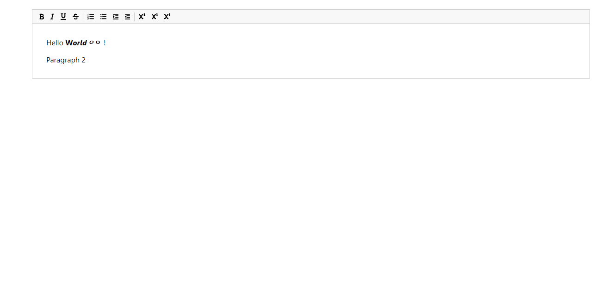

# SimpleTextEditor

## Languages and Frameworks Used:

- [React.js](https://reactjs.org/)

---

## What is this?

React를 이용해 만든 간단한 텍스트 에디터입니다.

---

### 실제 서비스 주소

- https://unruffled-knuth-1b5587.netlify.app/

---

### 주요기능

1.  주어진 텍스트에 몇 가지 edit 기능 제공
    - execCommand와 getSelection webAPI를 이용해 글자에 포커스가 되었을 때 어떤 기능이 적용되었는지 시각적으로 표시

---

### 사이트 화면 이미지

 - 텍스트에디터 화면
